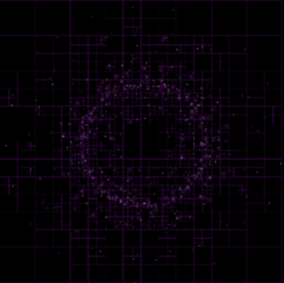
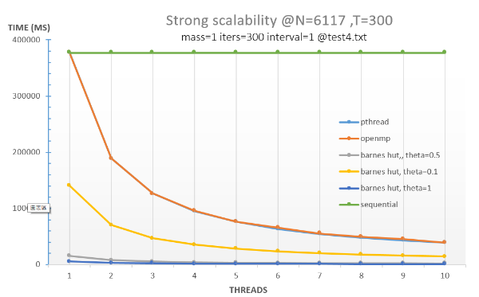
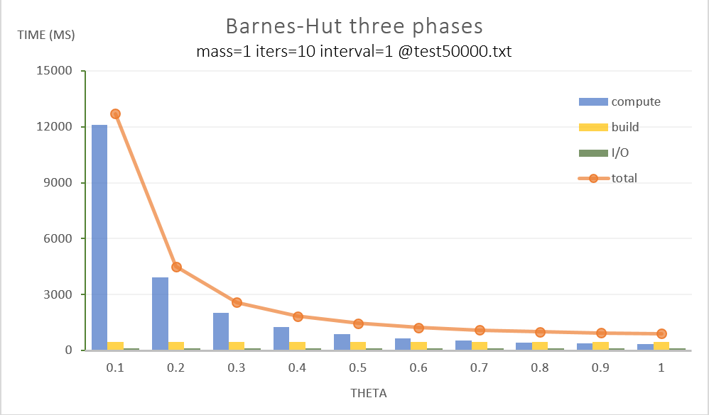

# Parallel N-Body Simulation

Multiple parallel and fast implementations of N-body simulation.

Here are four implementations:
- Sequential
- Parallel in `OpenMP`
- Parallel in `pthread`
- Use `Barnes-Hut` algorithm and parallel in `pthread`

# Compare each version

# Cost in each Barnes-Hut phase

